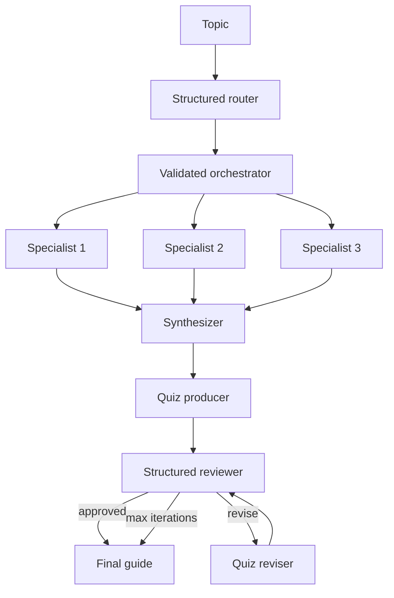

# Multi-Agent Study Guide with Python, LangGraph, Ollama, and Qwen

A collection of local multi-agent workflows that generate study guides using Python, LangGraph, Ollama, and the `qwen3.5:4b` model. The project progresses from a simple sequential pipeline to structured routing, dynamic parallel delegation, synthesis, review, retries, and safe fallbacks.

All LLM calls run locally through Ollama, so no paid API key is required.

## What Is an Agent Here?

In this project, an agent is a focused LLM call with a specific responsibility, its own prompt and instructions, and a defined position in the workflow. Agents collaborate by passing outputs through regular Python variables or LangGraph shared state.

## Project Files

| File | Architecture | Description |
|---|---|---|
| `study_guide_v1.py` | Plain Python sequential | Planner, teacher, and quiz writer coordinated with regular Python |
| `study_guide_v2.py` | LangGraph sequential | Reimplements V1 using nodes, edges, and shared state |
| `study_guide_v3_simplifier.py` | Extended sequential | Adds a fourth agent that simplifies the notes |
| `study_guide_v4_parallel.py` | Parallel specialists | Concepts, examples, and quiz agents run independently before merging |
| `study_guide_v5_orchestrator.py` | Orchestrator-subagent | Creates assignments and dynamically delegates them to parallel subagents |
| `study_guide_v6_router.py` | Supervisor/router | Selects either a beginner or advanced teacher |
| `study_guide_v7_human_loop.py` | Human-in-the-loop | Pauses for human outline approval or revision feedback |
| `study_guide_v8_review_loop.py` | Review/refinement loop | Reviews the quiz and sends it back for revision when necessary |
| `study_guide_v9_structured_outputs.py` | Structured resilient workflow | Combines structured routing, validated orchestration, parallel workers, synthesis, quiz review, retries, and fallbacks |

## V9: Structured Outputs and Resilient Orchestration

V9 combines the earlier patterns into one end-to-end LangGraph workflow:

1. A structured router selects the learner level.
2. A Pydantic-validated orchestrator creates exactly three specialist assignments.
3. LangGraph `Send` dispatches the assignments to parallel subagents.
4. A reducer collects their sections and the synthesizer restores deterministic order.
5. A quiz producer creates three questions from the synthesized notes.
6. A structured reviewer approves the quiz or routes it to a revision node.
7. The reviewer retries malformed or empty structured responses once.
8. Safe fallbacks prevent invalid local-model JSON from crashing the workflow.
9. A two-revision limit prevents an infinite review loop and terminates with `max_iterations` when necessary.

The orchestrator also validates assignment count, uniqueness, length, and content. If structured generation fails or produces unsuitable tasks, it substitutes three known-good assignments covering core concepts, applications, and misconceptions.

### V9 flow



## Requirements

- Python
- [Ollama](https://ollama.com/)
- Ollama model `qwen3.5:4b`
- `langchain-ollama`
- `langgraph`
- `pydantic`

Developed and tested on Windows with Python 3.14.

## Installation

### 1. Install Ollama and pull the model

Download Ollama from [ollama.com/download](https://ollama.com/download), then run:

```powershell
ollama pull qwen3.5:4b
```

### 2. Create and activate a virtual environment

Windows PowerShell:

```powershell
python -m venv .venv
.\.venv\Scripts\Activate.ps1
```

macOS or Linux:

```bash
python3 -m venv .venv
source .venv/bin/activate
```

### 3. Install dependencies

```powershell
python -m pip install -r requirements.txt
```

## Running the Examples

| Version | Command |
|---|---|
| V1 - Plain Python | `python .\study_guide_v1.py` |
| V2 - LangGraph sequential | `python .\study_guide_v2.py` |
| V3 - Simplifier | `python .\study_guide_v3_simplifier.py` |
| V4 - Parallel specialists | `python .\study_guide_v4_parallel.py` |
| V5 - Orchestrator-subagent | `python .\study_guide_v5_orchestrator.py` |
| V6 - Supervisor/router | `python .\study_guide_v6_router.py` |
| V7 - Human-in-the-loop | `python .\study_guide_v7_human_loop.py` |
| V8 - Review/refinement | `python .\study_guide_v8_review_loop.py` |
| V9 - Structured resilient workflow | `python .\study_guide_v9_structured_outputs.py` |

To demonstrate V8's revision branch with an intentionally flawed initial quiz:

```powershell
python .\study_guide_v8_review_loop.py --demo-revision
```

V9 prompts for a topic. For example, enter `Newton's Laws of Motion` when prompted.

## Observed Local Timings

Performance varies with hardware, prompt length, generated output, and Ollama scheduling. These measurements came from one development machine.

| Version | Observed workflow time |
|---|---:|
| V1 - Plain Python sequential | About 547 seconds |
| V2 - LangGraph sequential | About 455 seconds |
| V3 - Simplifier | About 751 seconds |
| V4 - Parallel specialists | About 555 seconds |
| V5 - Orchestrator-subagent | About 611 seconds |
| V6 - Beginner route | About 475 seconds |
| V6 - Advanced route | About 788 seconds |
| V7 - Human-in-the-loop | About 897 seconds, including human review |
| V8 - Normal approval path | About 332 seconds |
| V8 - Controlled revision demo | About 2,085 seconds |
| V9 - Full resilient workflow | About 462 seconds; completed safely with `max_iterations` after malformed reviewer JSON |

## Verification

Verify V9 without starting Ollama:

```powershell
python -m py_compile .\study_guide_v9_structured_outputs.py
python -c "import study_guide_v9_structured_outputs as v9; v9.build_graph(); print('V9 graph compiled successfully')"
```

A full local run was also completed successfully. It generated and synthesized three specialist sections, generated and revised the quiz, safely handled invalid reviewer JSON, displayed the final guide and quiz, and returned to PowerShell without a traceback.

## Lessons Learned

- A multi-agent system can be built using regular Python and focused LLM calls.
- LangGraph makes state, branching, parallel execution, interrupts, and loops explicit.
- Structured output schemas improve reliability but do not eliminate malformed local-model responses.
- Validate structured content after parsing; schema validity alone does not guarantee useful assignments.
- Retries, deterministic fallbacks, and iteration limits turn model failures into safe workflow outcomes.
- Reducers and deterministic sorting make parallel worker aggregation predictable.
- More agents do not automatically produce better results.
- Local LLM output should still be checked for factual accuracy.

## Acknowledgements

Inspired by the freeCodeCamp tutorial [How to Build Your First Multi-Agent AI System in Python and LangGraph](https://www.freecodecamp.org/news/how-to-build-your-first-multi-agent-ai-system-in-python-and-langgraph/).

This project extends the original sequential example with simplification, parallel execution, dynamic delegation, routing, human approval, automated review loops, structured outputs, and resilient failure handling.
