# Architecture Guide

This guide shows how the multi-agent study guide evolves from a simple Python pipeline into a complete application architecture. Each diagram uses the actual project components and routing behavior.

- V1-V10 are implemented.
- V11-V17 are planned designs. Their diagrams will be checked and updated when each version is implemented.
- Solid arrows show the normal execution path.
- Labeled branches show conditional routing, review decisions, or recovery behavior.

## Architecture evolution

| Stage | Versions | Main idea |
|---|---|---|
| Foundations | V1-V3 | Sequential generation and clearer notes |
| Coordination | V4-V6 | Parallel work, delegation, and routing |
| Control | V7-V8 | Human approval and automated refinement |
| Reliability | V9-V10 | Structured outputs, fallbacks, and persistent recovery |
| Context | V11-V13 | Long-term memory, retrieval, and tools |
| Adaptation | V14-V16 | Dynamic planning, evaluation, and human control |
| Delivery | V17 | Application, API, persistence, and deployment |

## V1: Plain Python sequential agents

**Status:** Implemented

V1 passes ordinary Python return values from one focused LLM call to the next. There is no graph runtime or shared state object.

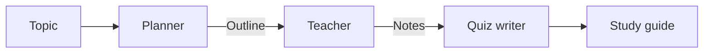

## V2: LangGraph sequential workflow

**Status:** Implemented

V2 preserves the V1 sequence but moves orchestration into a LangGraph state graph. Each node reads and updates shared `StudyState`.

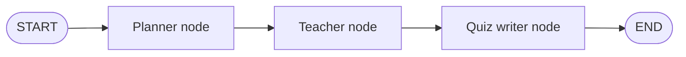

## V3: Sequential simplification

**Status:** Implemented

V3 adds a simplifier between teaching and quiz generation so the quiz is based on the clearer notes.

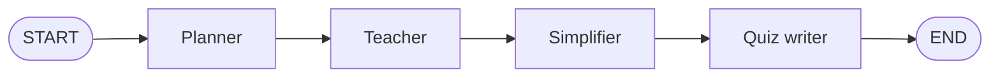

## V4: Parallel specialist workers

**Status:** Implemented

Three specialists receive the same topic at the same time. LangGraph waits for all branches before the merger creates the final guide.

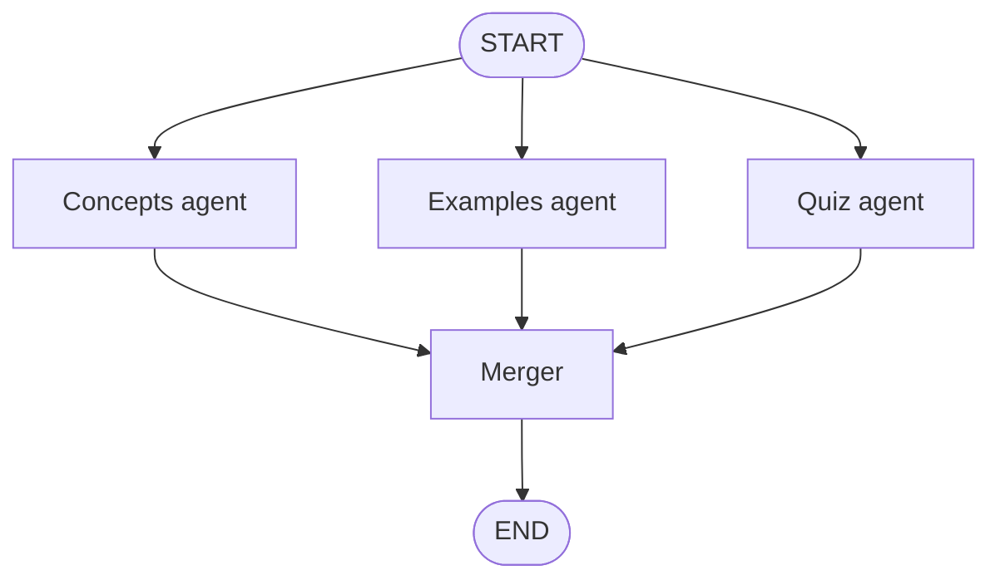

## V5: Orchestrator and delegated subagents

**Status:** Implemented

The orchestrator creates task assignments. `Send` dynamically launches a subagent for each assignment, and the synthesizer combines their results.

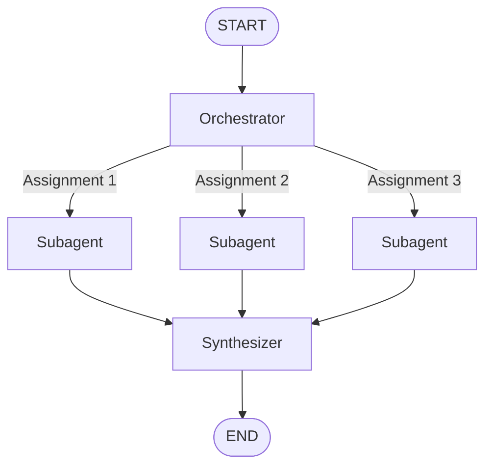

## V6: Supervisor routing

**Status:** Implemented

The router classifies the requested learning level. Only the selected teacher branch runs before the shared quiz writer.

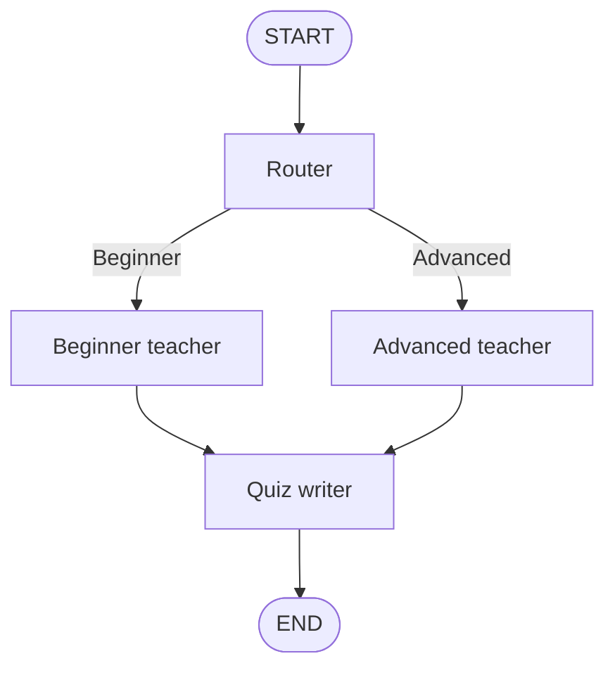

## V7: Human approval loop

**Status:** Implemented

The graph interrupts after an outline is prepared. Approval continues to teaching, while rejection stores feedback and loops through outline revision.

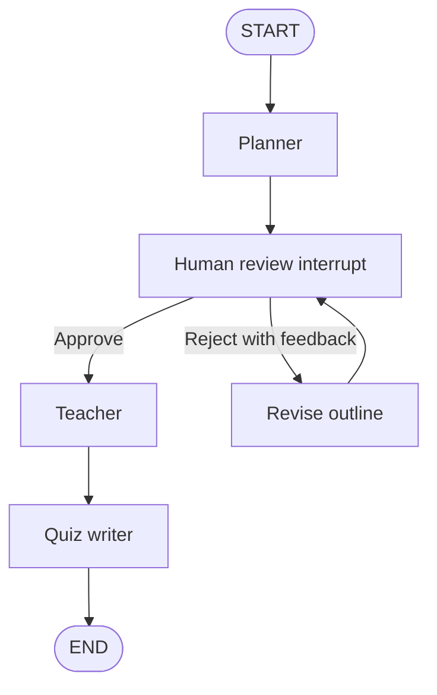

## V8: Automated review and refinement

**Status:** Implemented

The reviewer checks the generated quiz. A rejected quiz goes to the reviser and returns for another review. Approval or the revision limit ends the graph.

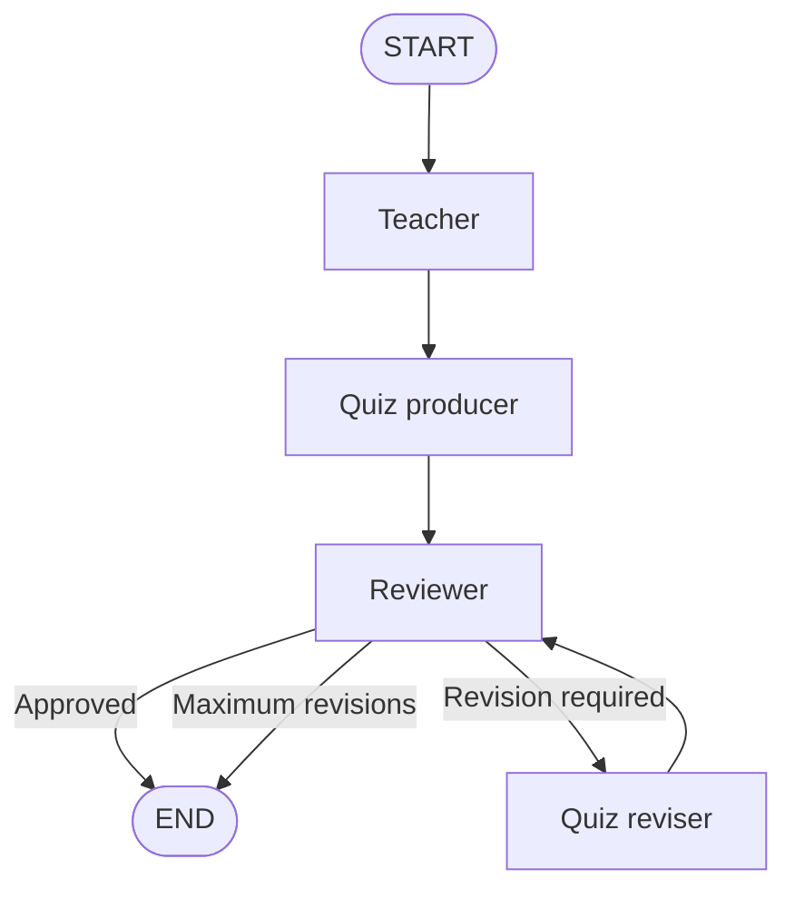

## V9: Structured multi-agent workflow

**Status:** Implemented

V9 combines validated routing, structured assignment planning, dynamic parallel workers, synthesis, quiz generation, structured review, retry controls, and safe termination.

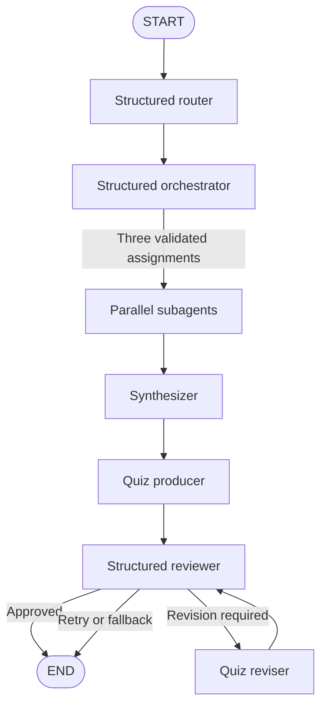

### V9 reliability controls

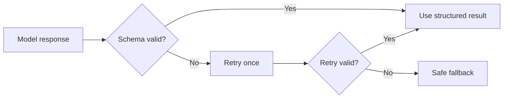

## V10: Persistent checkpointing and recovery

**Status:** Implemented

V10 compiles the V9 graph with `SqliteSaver`. A thread ID connects each session to durable graph state, allowing pause, resume, completed-session loading, and recovery without repeating completed nodes.

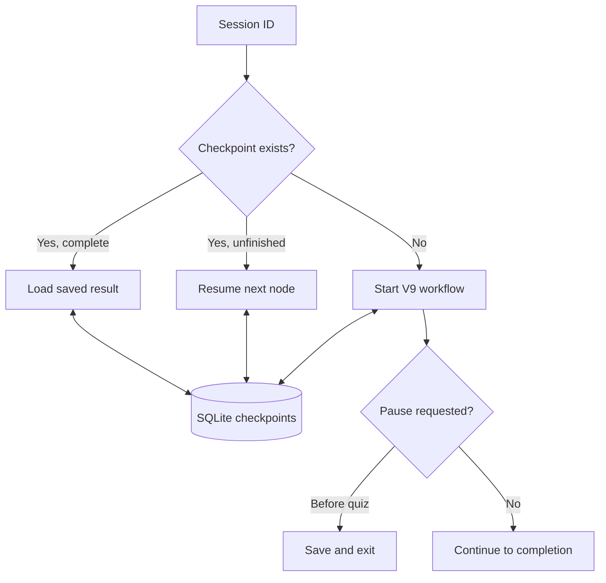

### V10 workflow with persistence

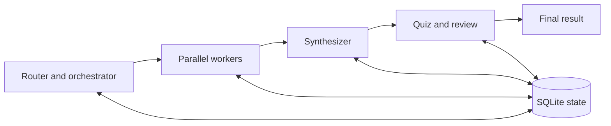

## V11: Cross-session learner memory

**Status:** Planned

V11 will separate durable learner memory from per-run checkpoints. The workflow will read relevant preferences and progress before planning, then save verified learning outcomes after the session.

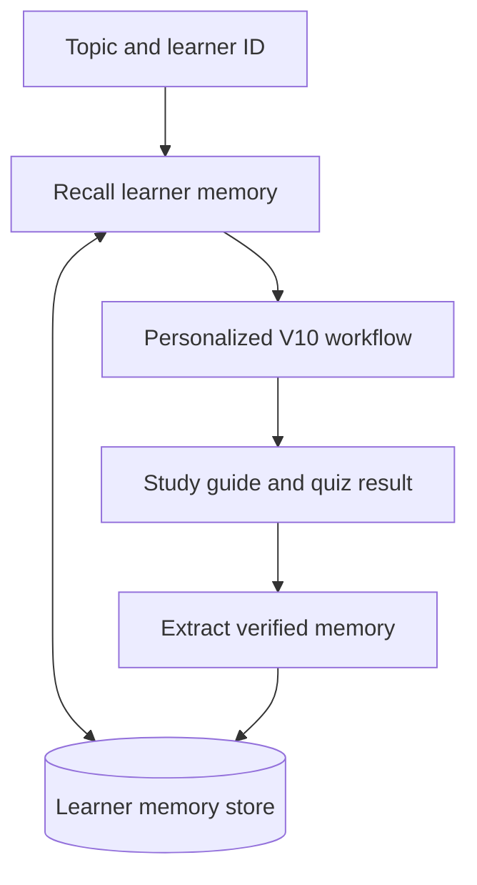

Planned memory includes learner level, preferences, completed topics, quiz performance, recurring mistakes, and progress. Temporary model text will not be saved as trusted memory without validation.

## V12: Retrieval with trusted documents and citations

**Status:** Planned

V12 will ground study content in approved local sources. Retrieved chunks and source metadata will flow into generation so the final guide can cite its evidence.

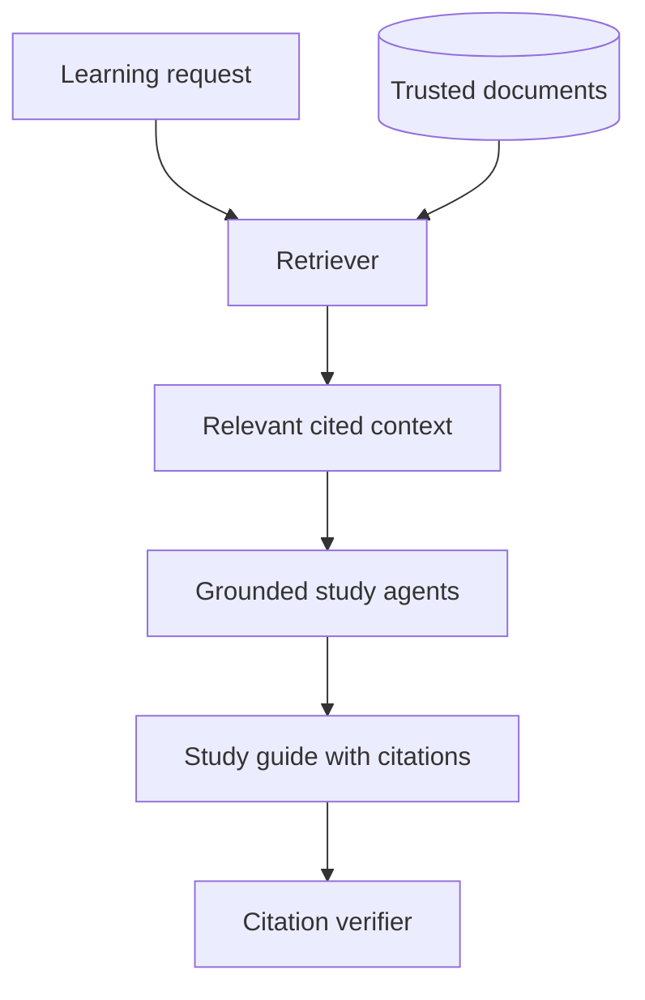

## V13: Tool-using study agents

**Status:** Planned

V13 will let an agent choose from a controlled tool registry. Tool results return as observations before the agent produces its final response.

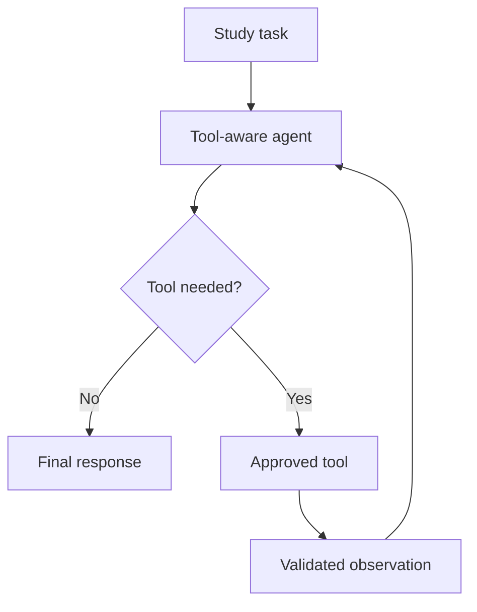

## V14: Dynamic planning and agent selection

**Status:** Planned

V14 will create a plan from the request, select only the required agents and tools, evaluate intermediate progress, and replan when a task fails or new information changes the path.

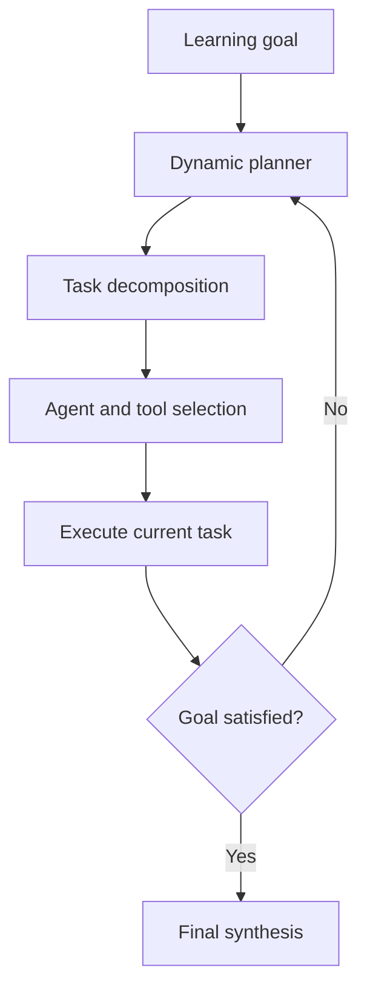

## V15: Evaluation and observability

**Status:** Planned

V15 will instrument workflow execution and evaluate output quality. Traces, latency, route choices, retries, retrieval quality, and learning-quality checks will support debugging and comparison.

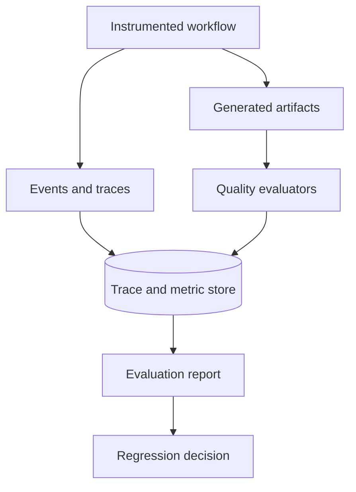

## V16: Multi-stage human approval

**Status:** Planned

V16 will expand V7 from one outline decision to several controlled review points. A learner can approve, edit, reject, or redirect important state before execution continues.

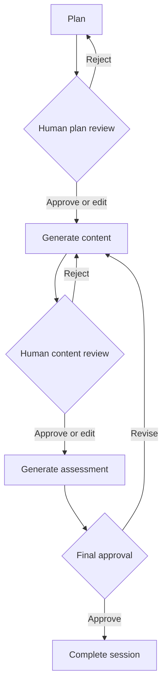

## V17: Application and deployment

**Status:** Planned

V17 will expose the workflow through a user application and API. The service architecture will combine local model inference, checkpoint state, learner memory, trusted retrieval, tools, and observability.

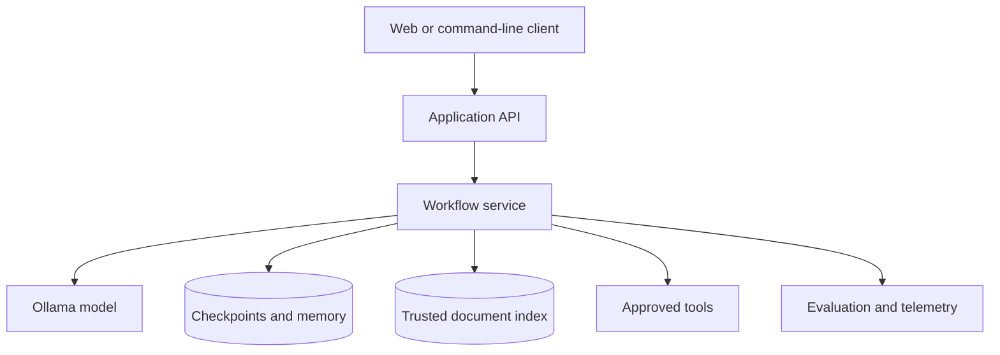

## Version relationships

Later versions build on earlier capabilities, but every file remains runnable as a separate learning example.

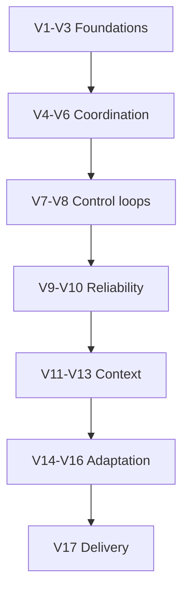

The planned architecture is intentionally incremental. V11-V17 will be implemented as separate versions, tested, documented, and compared without replacing the earlier examples.
